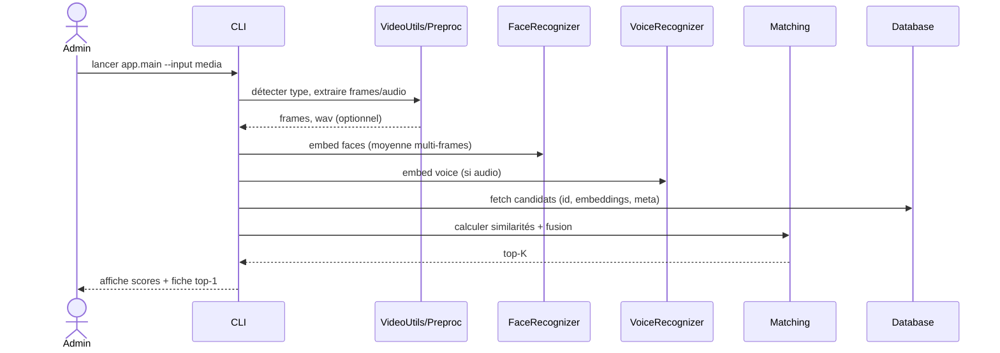

# Architecture BioMatch

## Vue d'ensemble
- UI (CLI)
- Recognition: Face (MTCNN + InceptionResnetV1), Voice (Resemblyzer)
- Matching: similarité cosinus + fusion pondérée
- DB: SQLite (par défaut) ou PostgreSQL
- Utils: IO vidéo/image/audio, prétraitements

```mermaid
flowchart LR
  A[Entrée média (image/vidéo)] -->|VideoUtils| B[Extraction frames]
  A -->|VideoUtils| C[Extraction audio]
  B --> D[FaceRecognizer -> embeddings]
  C --> E[VoiceRecognizer -> embedding]
  D --> F[Matching]
  E --> F
  F --> G[(DB: persons)]
  G --> H[Résultats (Top-K + détails)]
```

## Séquence (reconnaissance)


## Modèle de données (simplifié)
- Table `persons`:
  - `id` (PK)
  - `full_name`, `email`, `phone`, `address`, `notes`
  - `face_embedding` (TEXT, liste de floats sérialisés)
  - `voice_embedding` (TEXT)
  - `created_at`, `updated_at`

## Paramétrage
- `config.yaml`: `matching.{min_confidence, face_weight, voice_weight, topk}`
- `video.{sample_fps, max_frames}`
- `face.{detection_threshold, image_enhance}`
- `voice.{min_duration_seconds}`